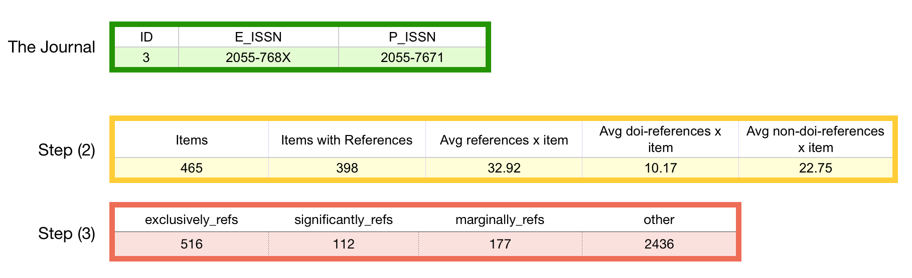

# 4 October 2019

***
## Digital Library 
I have arranged a meeting with Tommaso Vitale for a status overview of the Digital library project, some interesting things we have discussed:  
 
1. The new addition of the “Zeri Collection” into the digital library;
2. The data of the items have been structured a bit more, and we have new metadata for them;
3. We made some new additions on the Web Interface.

## DH Journals analysis via Crossref
I have expanded the analysis I have started last week with additional elaborations, following the meeting notes/comments received by Giovanni Colavizza and Gianmarco Spinaci. I gave a special attention regarding this particular question, which I found to be very interesting: 

* **Is it possible to classify further the citations in those which refer to other publications inside the set of DH journals, and those that are external to it ?**

In order to accomplish this, I used again the Crossref dataset, and followed these workflow steps:

1. Take in consideration all the DH Journals items collected (those having DOIS). You can find the complete list, at the following link:  
2. Retrieve the data of each item in the reference list, in case such item is identified with a DOI, otherwise save the reference item as it is separately (I will try get to the related resources with alternative strategies later, maybe "Microsoft Academic"). You can find a summary of the reference list retrieved, at the following link: 
3. **Check each DOI-reference having a specified ISSN in its data**, and classify them in 4 different groups: **[exclusively_refs, significantly_refs, marginally_refs, other]**  
You can find a summary of the reference list retrieved, at the following link:

Here is an example for **DH journal with Id=3:**

## Ph.D. thesis: Microsoft Academic Graph Knowledge
Two important articles regarding the Microsoft Academic dataset and it's impact on the bibliometrics study: 

1. Paszcza, B. (2016). Comparison of Microsoft academic (graph) with web of science, scopus and google scholar (Doctoral dissertation, University of Southampton). [https://doi.org/10.13140/RG.2.2.21858.94405](https://doi.org/10.13140/RG.2.2.21858.94405) 
2. Kousha, K., & Thelwall, M. (2018). Can Microsoft Academic help to assess the citation impact of academic books?. Journal of Informetrics, 12(3), 972-984. [https://doi.org/10.1016/j.joi.2018.08.003](https://doi.org/10.1016/j.joi.2018.08.003). 

> Although Microsoft Academic does not claim to be a citation index for books, it incorporates records for at least 60% of BKCI books from 2013-2016 and has extracted some citations from books in addition to citations from journal articles, preprints and other document types. It has better coverage of older books and scientific books.

About books:
> Microsoft Academic finding many non-WoS citations to books in History and Archaeology (76%), Art (73%), Languages and Literature (71%) and Law (70%) and Sociology (70%). Microsoft Academic had a lower citation advantage over Google Books.

## Microsoft Academic Graph
[https://docs.microsoft.com/en-us/academic-services/graph/ 
](https://docs.microsoft.com/en-us/academic-services/graph/). 

Regular snapshots of Microsoft Academic Graph are available for download by Open Academic Society. 

* Arnab Sinha, Zhihong Shen, Yang Song, Hao Ma, Darrin Eide, Bo-June (Paul) Hsu, and Kuansan Wang. 2015. An Overview of Microsoft Academic Service (MAS) and Applications. In Proceedings of the 24th International Conference on World Wide Web (WWW ’15 Companion). ACM, New York, NY, USA, 243-246. DOI= [http://dx.doi.org/10.1145/2740908.2742839](http://dx.doi.org/10.1145/2740908.2742839)

### Open Academic Graph (OAG)
[https://www.openacademic.ai/oag/](https://www.openacademic.ai/oag/) 

Microsoft Academic Graph (MAG) and AMiner are the two main sources used. ArnetMiner (AMiner) is designed to search and perform data mining operations against academic publications on the Internet, using social network analysis to identify connections between researchers, conferences, and publications.

> Open Academic Graph (OAG) is a large knowledge graph unifying two billion-scale academic graphs: Microsoft Academic Graph (MAG) and AMiner. In mid 2017, we published OAG v1, which contains 166,192,182 papers from MAG and 154,771,162 papers from AMiner (see below) and generated 64,639,608 linking (matching) relations between the two graphs. This time, in OAG v2, author, venue and newer publication data and the corresponding matchings are available.

### The Rest API service

**The available operations:**
[https://msr-apis.portal.azure-api.net/docs/services/academic-search-api/operations/565d753be597ed16ac3ffc03?](https://msr-apis.portal.azure-api.net/docs/services/academic-search-api/operations/565d753be597ed16ac3ffc03?)

**The Expression syntax:**
[https://github.com/MicrosoftDocs/azure-docs/blob/master/articles/cognitive-services/Academic-Knowledge/QueryExpressionSyntax.md](https://github.com/MicrosoftDocs/azure-docs/blob/master/articles/cognitive-services/Academic-Knowledge/QueryExpressionSyntax.md)

**Example:**
[http://api.labs.cognitive.microsoft.com/academic/v1.0/evaluate?expr=Composite(AA.AuN=“Harabagiu Sanda")&model=latest&count=10&offset=0&attributes=Id,Ti,J.JN,J.JId,Y&subscription-key=<YOURKEY>](http://api.labs.cognitive.microsoft.com/academic/v1.0/evaluate?expr=Composite(AA.AuN=“Harabagiu Sanda")&model=latest&count=10&offset=0&attributes=Id,Ti,J.JN,J.JId,Y&subscription-key=<YOURKEY>)

