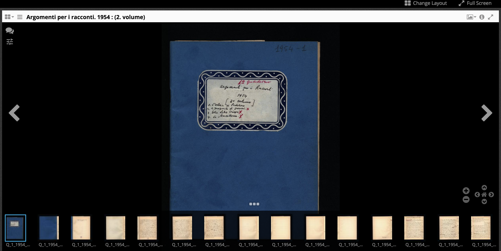

# 13 September 2019
***
## Ph.D. thesis: Bibliometrics, Scientometrics, and Science Of Science 
One of the comments I have on my thesis abstract (at [https://tinyurl.com/y42jwj6j](https://tinyurl.com/y42jwj6j)), which I think is crucial is:
> "There are two communities: (1) Scientometrics and (2) Science of science. These communities are somewhat competing. The ISSI conference is attended mainly by the scientometric community. Therefore it's better to position your work in the scientometric community, or alternatively, to position it as research in quantitative science studies. I use the term 'quantitative science studies' as an umbrella term to refer to both communities.
Having read your full proposal, I believe that also from a substantive point of view your way of thinking fits better with scientometrics than with science of science. For instance, quantitative modeling usually plays an important role in science of science research, which is not the case in your proposal." by Ludo Waltman

Considering this, I think is very important to understand what are the main differences between the two fields, and whether my analysis is closer to Scientometric or a ScienceOfScience field of study.  
### Notable references
* Zavaraqi, R., & Fadaie, G. R. (2012). Scientometrics or science of science: quantitative, qualitative or mixed one. Collnet Journal of Scientometrics and Information Management, 6(2), 273-278. DOI= [https://doi.org/10.1080/09737766.2012.10700939](https://doi.org/10.1080/09737766.2012.10700939) 
* Leydesdorff, L., & Milojević, S. (2012). Scientometrics. arXiv preprint arXiv:1208.4566. [http://arxiv.org/abs/1208.4566](http://arxiv.org/abs/1208.4566)
* Mingers, J., & Leydesdorff, L. (2015). A review of theory and practice in scientometrics. European journal of operational research, 246(1), 1-19. DOI= [https://doi.org/10.1016/j.ejor.2015.04.002](https://doi.org/10.1016/j.ejor.2015.04.002)

## Ph.D. thesis: datasets
I have read some summary reviews regarding the data coverage of the main online scholarly indexes, e.g. WebOfScience. For my thesis case, I would like to make an analysis on which datasets I can rely for in the analysis of Humanities domain materials. 
### Notable references
*  Mingers, J., & Leydesdorff, L. (2015). A review of theory and practice in scientometrics. European journal of operational research, 246(1), 1-19. DOI= [https://doi.org/10.1016/j.ejor.2015.04.002](https://doi.org/10.1016/j.ejor.2015.04.002)

## Dharc: The Digital Library web site
I have arranged a meeting with Tommaso Vitale and we have discussed the next steps to adopt on the DigitalLibrary web site. The biggest issue right now is related to the lack of metadata we currently have associated to the elements already digitalised in the library.   
I have developed a dedicated browsing page for the Digital Library resources: items, and collections. The browser is based on Mirador Viewer (https://github.com/Daniel-KM/Omeka-S-module-Mirador). Each item of the Digital Library could be visualised (with the list of its metadata) at: http://137.204.168.8/s/digital-library/item/. e.g. [http://137.204.168.8/s/digital-library/item/18](http://137.204.168.8/s/digital-library/item/18).   
After that to open the dedicated viewer for such item, one must click on its preview picture, and the corresponding item will be visualised using Mirador in a dedicated page. e.g. For item 18, the corresponding link is: [http://137.204.168.8/s/digital-library/page/view?id=18&type=item](http://137.204.168.8/s/digital-library/page/view?id=18&type=item).
  
