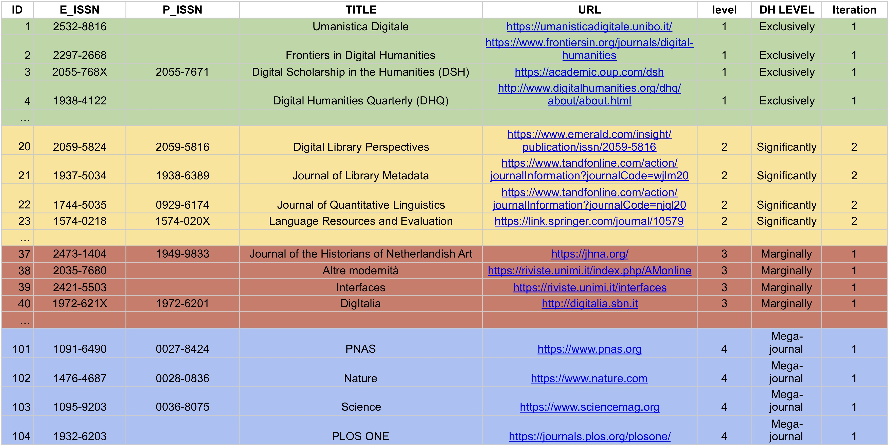
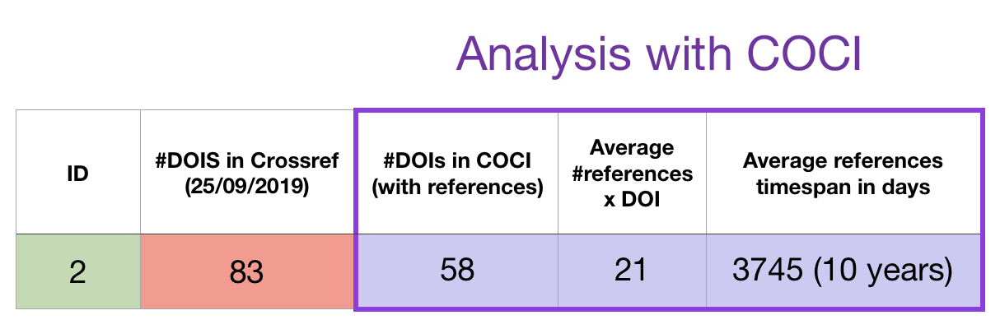

# 20 September 2019
***
## Ph.D. thesis: DH journals analysis through COCI
Taking in consideration the results obtained by “Preliminary results on mapping digital humanities research”, by Spinaci, Colavizza, and Peroni.
This work have established 4 different levels of journals affinity to the Digital Humanities discipline.   
Here is a sample of the results of the Digital Humanities Journals obtained by this work:

My analysis have been made following these steps:  
 
1. Check the number of DOIs in Crossref for each Journal of the list: The Crossref API calls have been made using both the ISSN values, and the results have been merged.
2. Call COCI for each DOI value returned from the previous step, and:
    1. Count the number of DOIs present in COCI
    2. Calculate the average number of references for each journal
    3.  Calculate the average timespan of the references for each journal

Here we have an example of the results obtained for the journal with ID=2:

Some important comments:

* Crossref might have **both/one/none** the ISSN values (P-ISSN, and E-ISSN). **Therefore during the elaboration I made the crossref API calls for both the ISSN values and merged the results obtained.**
* The elaboration has been made on the list of Journals which are affiliated to Digital Humanities discipline following a DH-Level defined by Spinaci et.al in three different levels: "Exclusively”, “Significantly”, “Marginally”. **The “Mega-journal" class of journals have been excluded.** 

  